# From Spectrum Heatmaps to Numeric Time Series: A Pipeline for SpecMon Data Collection, Analysis, and Forecasting

**Abstract** — We describe an end-to-end pipeline for collecting spectrum monitoring heatmaps from CableLabs SpecMon, converting them into numeric time series, and supporting both next-day prediction and hourly forecasting. The pipeline comprises automated scraping of heatmap images, a perceptually calibrated color-to-value mapping with per-image scale extraction and OCR, and a transformation stage that produces a regular grid of hourly values per frequency band. We apply a multi-method prediction module with confidence scoring and error reporting, and online learning over simple models (exponential smoothing, linear, moving average). An interactive web-based visualization runs after the analysis step and provides a date selector so that predicted and actual grids can be viewed for any day. The analysis-stage predictions are effectively seasonal exponential smoothing or linear models over the past six days, with error computed per day; only after framing the problem as time series did we recognize this and add a dedicated Jupyter notebook for decomposition and 1-step-ahead forecasting. We report that a validation-tuned blend of last-hour and same-hour-yesterday slightly outperforms the naive baseline (e.g. MAE 2.40 vs 2.42). We summarize all methods tried and the role of each stage in a reproducible workflow suitable for extension and publication.

---

## 1. Introduction

Spectrum monitoring systems produce large volumes of spatial and temporal data that are often visualized as heatmaps (e.g. hour-of-day vs frequency, color-coded by utilization or power). Operational and research use cases require converting these visual outputs into numeric series for analysis and prediction. We present a complete pipeline that (1) collects heatmap images from the SpecMon web interface via automated scraping, (2) maps colors to numeric values using a calibrated scale and per-image scale extraction, (3) transforms each image into a structured table of hourly values per frequency band, (4) runs next-day prediction with multiple methods, confidence, and error reporting, and (5) provides an interactive web-based visualization with a date selector for viewing predicted and actual grids for any day. When building the analysis stage we assumed that online learning could be applied with simple models such as exponential smoothing, linear regression, or moving average. The resulting predictions are effectively seasonal exponential smoothing or linear models over the past six days, with error computed per day rather than per hour. Only after learning about time series did we recognize this interpretation; we then created a Jupyter notebook in the time_series folder for decomposition (trend, seasonality, residual) and 1-step-ahead forecasting baselines. The pipeline is described in terms of inputs, outputs, and methodology without reliance on code.

---

## 2. Data Collection and Pipeline

### 2.1 Scraping

Data collection starts at the SpecMon web interface. A browser automation layer performs login using stored credentials, selects the desired location and graph type (e.g. “Hour of Day” heatmap), and configures date range, frequency range (e.g. 3.1–3.45 GHz), and power threshold. For each date in the range, the system captures a screenshot of the heatmap. Raw screenshots are stored; a preprocessing step crops and normalizes the region of interest so that each output image contains a consistent layout: a main graph (hours × frequency bands) and a vertical color scale on the right with a numeric maximum value label. These preprocessed images form the input to the color and transformation stages. Figure 1 shows an example preprocessed heatmap for one day.

**Figure 1.** Preprocessed heatmap for one day (hours 0–23, frequency bands 3.1–3.45 GHz). Color encodes value (e.g. utilization); the scale and its maximum are on the right.

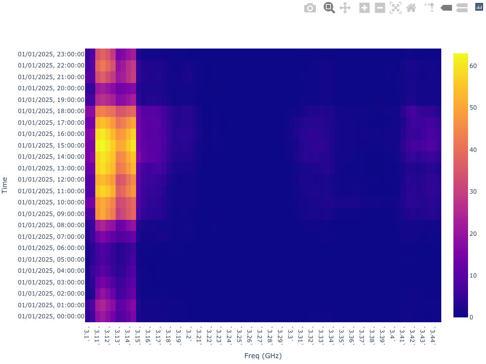

### 2.2 Color Scale and Validation

The pipeline maps pixel colors to numeric values using a vertical reference scale: dark blue corresponds to zero and yellow to the maximum. The reference scale is stored as a single image and read vertically (top = max, bottom = zero). To improve perceptual consistency, color-to-value conversion is performed in LAB color space: for each pixel, the closest color on the scale (by Euclidean distance in LAB) is found and its position is mapped linearly to a value in [0, max]. When processing heatmap images, we do not rely solely on the reference scale: for each image, the transformation stage detects the scale region on the right, samples colors along it, and reads the maximum value from the scale label via OCR. The color mapping for that image then uses this per-image scale and max value, so that variations in rendering or labeling across days are accounted for.

Validation of the color pipeline is done in two ways. First, the reference scale can be visualized with value increments to confirm the mapping. Second, a dedicated *test color scale* step runs on a sample of preprocessed images and both validates and illustrates per-image scale extraction; it is described in the next paragraph. Figure 2 shows the reference scale; Figure 3 shows an example output of the test color scale step.

**Test color scale.** This step takes a configurable number of preprocessed heatmap images (e.g. the first five by date) and, for each image, runs the same scale-detection and extraction logic used in the transformation stage: the right-hand region is scanned for the vertical color scale (e.g. by gradient strength), a narrow vertical band is fixed, and colors are sampled along the bar from top to bottom. OCR is applied to the scale label to read the maximum value (e.g. 60); multiple regions and preprocessing options (contrast, thresholding) are tried so that the numeric label is recovered reliably. Optionally, all numeric labels on the scale are located (by running OCR on vertical slices beside the scale) to infer where the “max” label sits relative to the top of the bar; the value at the top (brightest yellow) can then be extrapolated from the labeled max and its position (e.g. actual_max = labeled_max / position_ratio), which improves calibration when the printed max does not sit exactly at the top pixel. The test then builds an explicit value-to-color mapping: for a set of numeric values (e.g. 0, 5, 10, … up to the inferred maximum), each value is mapped to a position on the extracted scale (linear in value, with top = max and bottom = 0), and the corresponding color is obtained by interpolating between the sampled scale colors. The result is visualized as a grid of color swatches, each labeled with the numeric value and the hex color, and saved as an image (e.g. one per input heatmap). This process verifies that (1) scale region detection succeeds on real preprocessed images, (2) OCR recovers a plausible maximum value, (3) the extracted color sequence is usable for a smooth value-to-color mapping, and (4) the inferred mapping can be inspected visually (e.g. progression from dark blue at zero to yellow at max). Any failure in scale detection or OCR would cause the test to skip or fail for that image, so a successful test run gives confidence that the transformation stage will receive valid per-image scales when run on the same data.

**Figure 2.** Reference color scale (dark blue = 0, yellow = max).

**Figure 3.** Output of the test color scale step for one preprocessed heatmap. The grid shows the value-to-color mapping inferred from the *extracted* scale for that image: each swatch is labeled with a numeric value and its hex color, from 0 (dark blue) to the OCR-derived maximum (yellow). This validates per-image scale detection and OCR on real data.

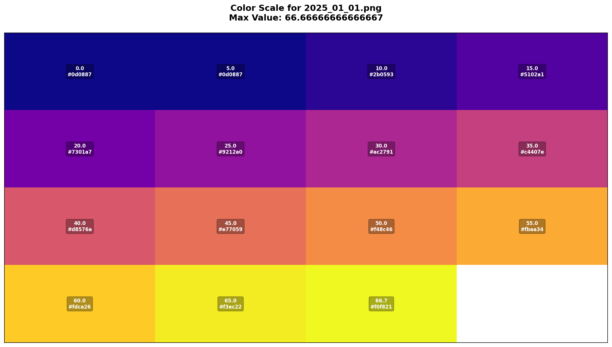

### 2.3 Image-to-Data Transformation

Each preprocessed image is converted into a numeric table. The transformation stage (1) detects the color scale in the right-hand portion of the image using gradient strength along the vertical direction and fixes a narrow vertical band for the scale; (2) reads the maximum value from the scale label using OCR with multiple regions and preprocessing strategies (contrast, thresholding), falling back to a default if OCR fails; (3) samples colors along the scale bar (top to bottom) and filters out border/background colors; (4) defines a fixed graph region aligned with the heatmap layout (e.g. 24 rows × 70 columns corresponding to hours 0–23 and frequency bands from 3.1 to 3.45 GHz in 0.005 GHz steps); (5) for each cell, takes the center pixel, maps its color to a value using the per-image scale and max value via the LAB-based color scale; (6) outputs one row per (date, hour) and one column per frequency band into a single combined table (e.g. Parquet). Optional debug outputs can save images showing the detected scale region and the grid of sampled cell centers. Figures 4 and 5 show examples of scale-region and dataframe-sampling debug visualizations.

**Figure 4.** Detected scale region on a preprocessed heatmap (debug output).

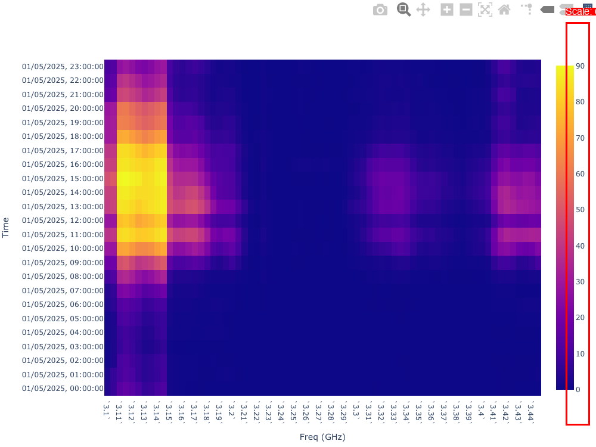

**Figure 5.** Grid of sampling points over the graph (debug output).

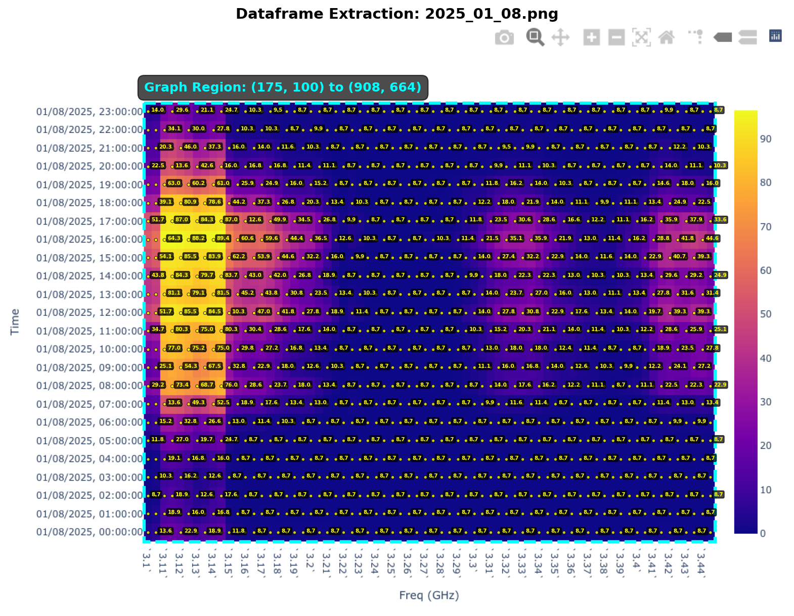

---

## 3. Analysis and Prediction

The transformed table (one row per date-hour, columns for each frequency band) is reshaped into a long form with (date, hour, frequency_band, value). The analysis stage produces next-day predictions for every (hour, frequency_band) cell, along with confidence scores and errors when actuals are available. When creating this model we believed that online learning could be used effectively with simple models such as exponential smoothing, linear regression, or moving average; the implementation reflects that choice.

### 3.1 Prediction Methods

Four prediction methods are implemented and can be selected per cell by an online learner (see below).

- **Exponential smoothing:** The next value is a convex combination of the previous value and the new observation; the smoothing parameter is set close to 1 so the forecast is near the last observation (persistence-like).
- **Moving average:** The prediction is the mean of the last few observations (e.g. last two hours) for that (hour, frequency_band) across recent days.
- **Linear regression:** A linear trend is fit over the lookback window for that cell; the prediction is the extrapolated value at the next time step.
- **Peak detection:** When recent history shows high volatility and a clear peak (e.g. value above a multiple of the mean and above a fraction of the recent maximum), the prediction is a damped function of that peak. This targets cells with sporadic high utilization.

Each method uses a configurable lookback (number of past days). In effect, the visualized predictions are seasonal exponential smoothing or linear models over the past six days (same hour, same frequency band across days). Error is calculated per day (comparing predicted vs actual for the full day’s grid) rather than per hour; only after framing the problem as time series did we recognize that this is what we had implemented.

### 3.2 Confidence and Error

A confidence score in [0, 1] is computed for each prediction. The score combines data availability, variation in the history, consistency with the chosen method, and accuracy history (recent normalized errors). Weights and decay are configurable. Error is defined as actual minus predicted. Normalized error is used to update accuracy history. Aggregate statistics over the error map (mean absolute error, max, min, fraction of cells with error below a small threshold) are computed for reporting.

### 3.3 Online Learning

The pipeline maintains persistent state per (hour, frequency_band) cell: for each prediction method, it stores a running list of accuracies (derived from normalized error when actuals become available). When making a prediction, the system selects the method with the best recent accuracy for that cell, with a small probability of choosing a random method for exploration. Lookback length can also be learned over time from daily accuracy. State is saved to disk so that each run continues from the previous one.

### 3.4 Visualization

After the analysis step completes, an interactive visualization is launched and opens in a web browser. It loads the prediction table and provides a **date selector** so that the user can view the full grid (24×70: hours × frequency bands) for **any day**. View modes include: **Predicted** (heatmap of predicted values), **Confidence** (heatmap of confidence scores), **Actual** (heatmap of observed values when available), and **Error** (signed error heatmap). This gives better insight than static images alone: predicted and actual values can be compared side by side for any chosen date. Summary statistics (mean confidence, mean/max/min error, fraction of near-zero errors) are shown. Figures 7–9 show the prediction viewer with date selector and example predicted and actual grids.

The analysis stage can also write static heatmap images for selected dates. Figure 6 shows an example prediction heatmap for one day.

**Figure 6.** Prediction heatmap for one day (analysis output).

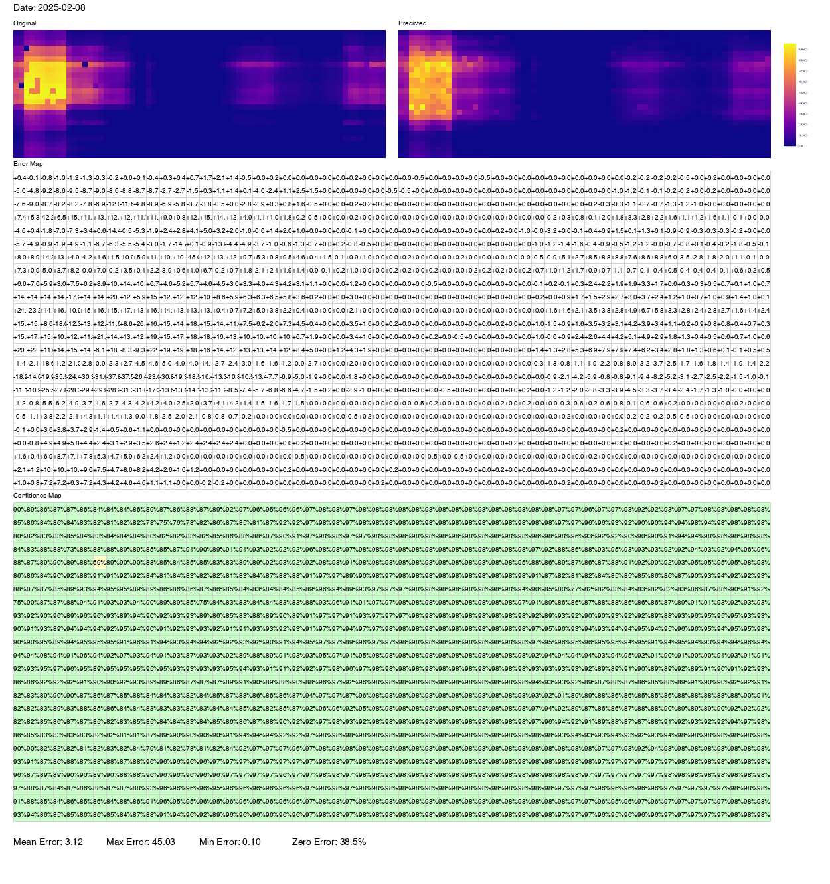

**Figure 7.** Prediction viewer: date selector and view options (runs in browser after analysis).

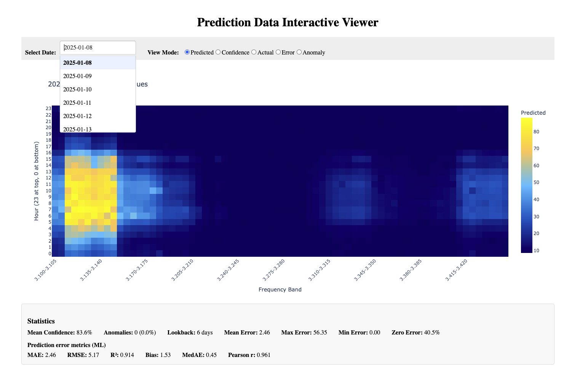

**Figure 8.** Predicted values for a selected day (grid: hours × frequency bands).

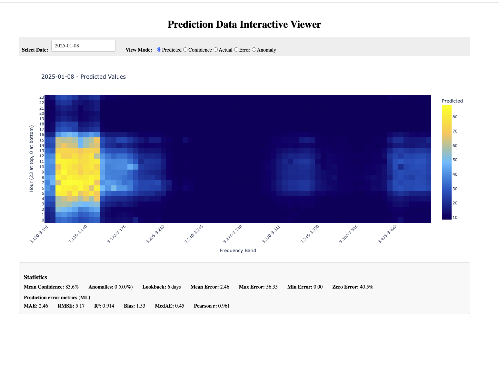

**Figure 9.** Actual values for the same day (grid: hours × frequency bands).

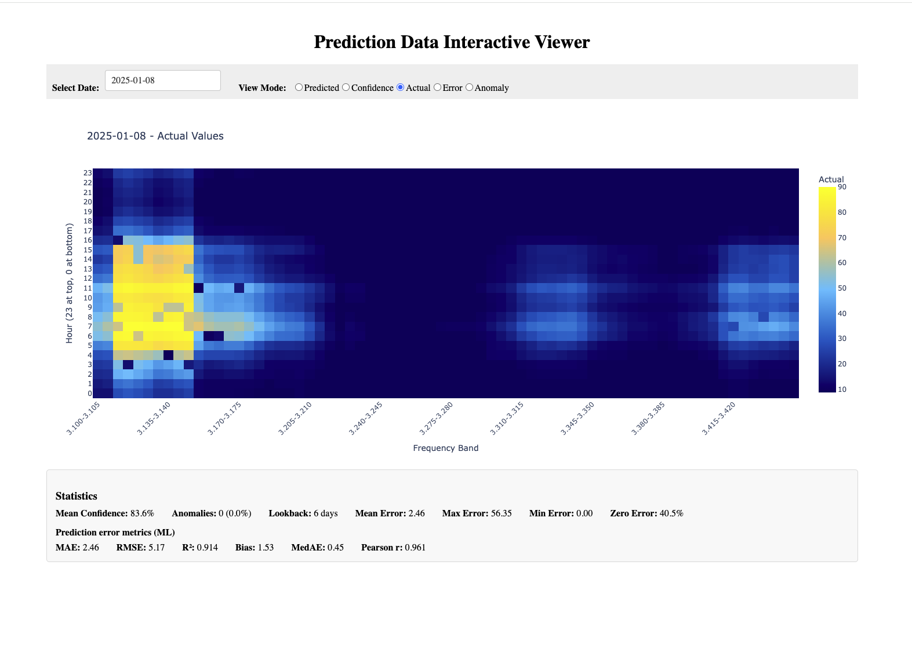

---

## 4. Time Series Exploration

### 4.1 Motivation

The transformed and prediction data are naturally indexed by (date, hour, frequency_band). For each frequency band, the sequence of hourly values forms a time series. Only after learning about time series did we recognize that the analysis-stage model (seasonal exponential smoothing / linear over the past six days, with error per day) was a particular time-series formulation. Once we realized the data was time series we created a Jupyter notebook in the time_series folder. That notebook loads the same transformed table, defines a fixed test window (e.g. the last year of hours), and evaluates 1-step-ahead forecasting models in a unified way (MAE, RMSE, MASE). The goal is to understand structure (trend, seasonality) and to see whether any model can systematically outperform a naive (last observation) baseline. The notebook provides a dropdown to select a frequency band and view the raw hourly series for that band. Figure 10 shows the raw time series with the frequency-range selector.

**Figure 10.** Raw time series for a selected frequency band (notebook UI with dropdown).

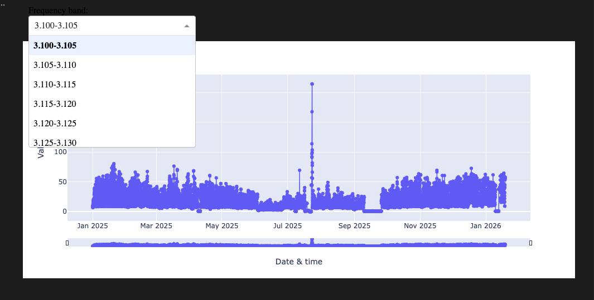

### 4.2 Decomposition

We apply additive decomposition to each frequency band’s series: **raw = trend + seasonal + residual**. The three components are defined as follows.

- **Trend** is the slow-moving, smooth level of the series over time. It captures long-term growth, decline, or drift (e.g. a gradual rise in utilization over weeks) and is typically estimated by a centered moving average over the seasonal period. It has no fixed repeating pattern.
- **Seasonality** is the repeating pattern at a fixed period (e.g. 24 hours for daily, 168 hours for weekly). It captures regular cycles—for example, higher values at certain hours each day or certain days each week—and is computed by extracting the periodic component after removing the trend.
- **Residual** is what remains after subtracting trend and seasonal from the raw series. It represents irregular, unpredictable variation: noise, one-off spikes, or structure that is not captured by trend or the chosen seasonal period. A well-fitting decomposition leaves residuals that look roughly random.

The seasonal component is computed with a fixed period; we support daily (24-hour) and weekly (168-hour) periods. Trend is obtained by a centered moving average over the period length, with extrapolation at the ends so that the residual is defined everywhere. The decomposition is visualized in four panels (raw, trend, seasonal, residual) so that daily vs weekly seasonality can be compared. This confirms a strong daily pattern and suggests that a weekly component may also be present in some bands. Figures 11 and 12 show the full decomposition view and a zoomed-in segment.

**Figure 11.** Decomposition into raw, trend, seasonal, and residual (four panels).

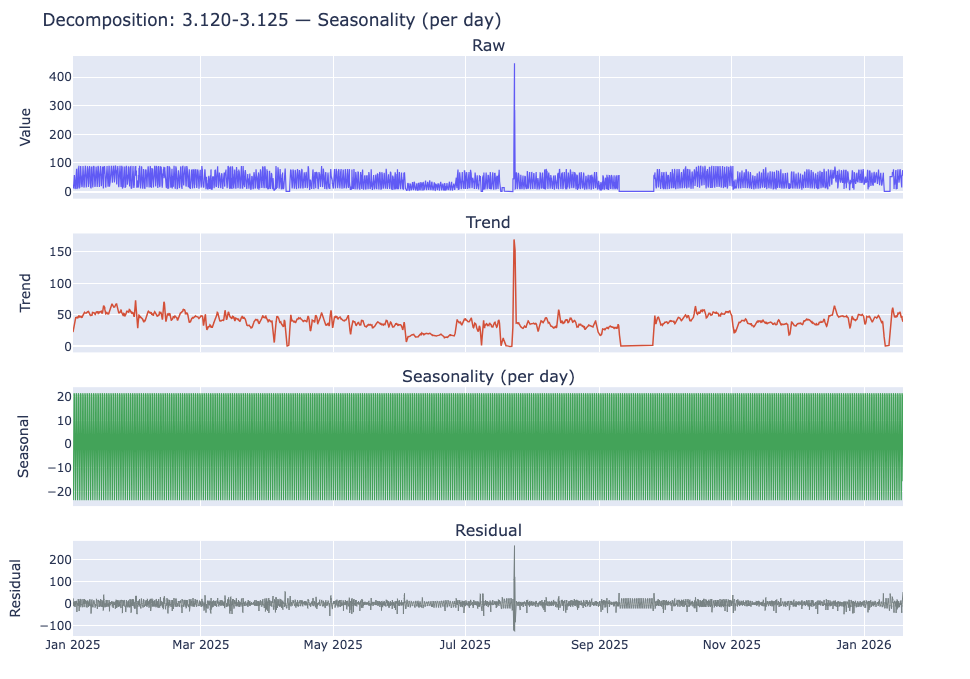

**Figure 12.** Decomposition zoomed in to show detail.

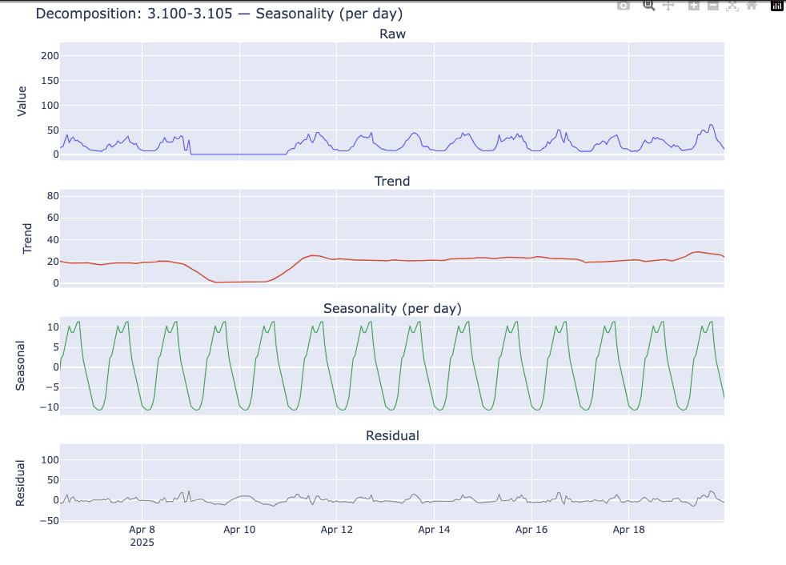

### 4.3 Forecasting Models Evaluated

All models are evaluated on the same test set (last 365×24 hours) with 1-step-ahead predictions. Metrics are MAE, RMSE, and MASE (scaled by the mean absolute first difference of the actuals on the test set, so that MASE = 1 for the naive forecast). The following were implemented and evaluated.

**Baselines and simple methods**

- **Naive:** Prediction = previous hour’s value. Serves as the main baseline (MASE = 1 by construction).
- **Moving average:** Prediction = mean of the last *k* hours (e.g. *k* = 2).
- **Exponential smoothing:** Prediction = α × previous value + (1 − α) × previous forecast; α close to 1 (e.g. 0.98).
- **Seasonal naive:** Prediction = value at the same hour one day ago (lag 24).
- **Median ensemble:** Prediction = median of naive and seasonal naive.

**Blends and linear combinations**

- **Hybrid (fixed blend):** 70% last hour + 30% same hour yesterday (fixed weights).
- **OLS blend:** For each band, fit ŷ = *a*·y(t−1) + *b*·y(t−24) + *c* on the training period by least squares; predict on the test set.
- **Tuned blend:** For each band, choose α in [0.97, 1] to minimize MAE on a short validation window (e.g. last 14 days before the test set); prediction = α·y(t−1) + (1−α)·y(t−24). This keeps the forecast naive-heavy while allowing a small daily-seasonal correction.
- **Tuned blend with longer validation:** Same as tuned blend but with a 28-day validation window.
- **Three-way blend:** For each band, choose (α, β, γ) with α+β+γ = 1 to minimize validation MAE; prediction = α·y(t−1) + β·y(t−24) + γ·y(t−168). This adds a weekly (168-hour) seasonal component.
- **Ridge with lags:** For each band, fit a Ridge regression of y(t) on a constant, y(t−1), y(t−24), and y(t−168); predict on the test set.

**Statistical and ML models**

- **ARIMA:** Rolling 1-step-ahead ARIMA(1,0,1) per band on a subset of bands (e.g. last 3 days of test for computational reasons).
- **Chronos:** A pretrained time-series foundation model (Chronos-2) used in a rolling-window setting (e.g. 72-hour horizon per window) for comparison; evaluation is aligned where possible with the 1-step setup.
- **Seasonal weighted average:** For each hour, prediction = weighted average of the same hour on the previous *N* days (e.g. *N* = 7), with higher weight on more recent days.
- **Seasonal exponential smoothing:** Exponential smoothing applied to the seasonal (same-hour-yesterday) series.
- **SARIMA:** Seasonal ARIMA with daily period (e.g. order and seasonal order tuned); evaluated on a subset for cost.

**How each experiment was tuned.** All models use the same test set (last 365×24 hours); no test data is used for tuning. **Naive** and **seasonal naive** have no hyperparameters. **Moving average** uses a fixed window (e.g. *k* = 2 hours). **Exponential smoothing** uses a fixed α close to 1 (e.g. 0.98) so the forecast is persistence-like. **Hybrid** uses fixed weights (70% last hour, 30% same hour yesterday). **OLS blend** is fit by least squares on the training (pre–test) period only; no validation tuning. **Median ensemble** is the median of naive and seasonal naive; no tuning. **Tuned blend** is the only model that uses a validation set: for each frequency band, α ∈ [0.97, 1.0] is chosen to minimize MAE on a short validation window (e.g. 14 days immediately before the test set); the same validation period is used for all bands. **Seasonal weighted average** uses a fixed *N* (e.g. 7 days) with higher weight on more recent days. **Seasonal exponential smoothing** uses the past 6 days at the same hour with smoothing that weights recent days more. **ARIMA** uses a fixed order (e.g. (1,0,1)); **Chronos-2** is pretrained and used with a fixed rolling-window horizon (e.g. 72 hours). **SARIMA** (when run) uses a fixed or lightly tuned order on a subset. No model sees the test set until the final evaluation.

### 4.4 Results (MAE, RMSE, MASE)

All metrics are on the same test set (last 365×24 hours, 1-step-ahead). **MAE** (mean absolute error) is the average of |actual − predicted|; **RMSE** (root mean squared error) is the square root of the average of (actual − predicted)²; **MASE** (mean absolute scaled error) is MAE of the model divided by the MAE of the naive 1-step forecast on the test set, so the naive baseline has MASE = 1 by construction—values below 1 indicate better than naive, above 1 worse.

| Model | MAE | RMSE | MASE |
|-------|-----|------|------|
| Naive | 2.4199 | 6.2706 | 1.0000 |
| Tuned blend | 2.4041 | 6.1691 | 0.9935 |
| Exponential smoothing | 2.4302 | 6.2546 | 1.0043 |
| Hybrid (70/30) | 2.5157 | 6.0237 | 1.0396 |
| OLS blend | 2.7532 | 6.0416 | 1.1450 |
| Median ensemble | 2.8368 | 6.8291 | 1.1723 |
| Moving average | 2.8825 | 6.6104 | 1.1912 |
| ARIMA | 6.5317 | 9.6009 | 1.1288 |
| Chronos-2 | 3.6528 | 8.8533 | 1.5249 |
| Seasonal weighted avg | 4.0999 | 9.1835 | 1.6943 |
| Seasonal exponential smoothing | 4.0173 | 9.3046 | 1.6602 |
| Seasonal naive | 4.2875 | 10.7625 | 1.7718 |

The best performer is the **tuned blend** (MAE 2.4041, MASE 0.9935), slightly better than naive (MAE 2.4199, MASE 1.0000). Exponential smoothing is very close to naive. The hybrid (70% last hour, 30% same hour yesterday) and OLS blend are next; moving average and pure seasonal methods (seasonal naive, seasonal weighted average, seasonal exponential smoothing) do worse. ARIMA and Chronos-2, in these configurations, do not beat the simple tuned blend on this 1-step metric.

**Figure 13.** Example error (e.g. MAE or MASE) per model, illustrating relative performance across forecasting methods.

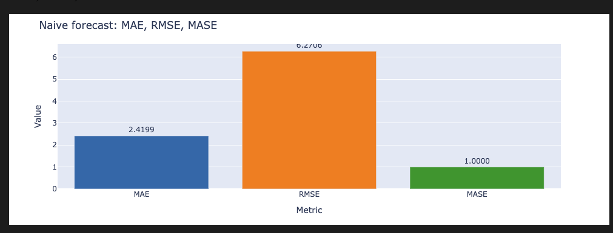

**Figure 14.** Example time series plot: actual vs predicted for each model (or a selected subset), showing how predictions track the actual series over time.

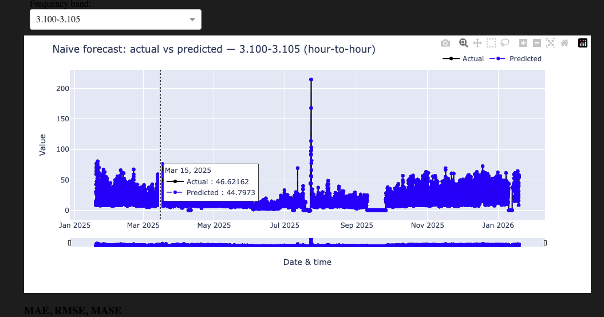

### 4.5 Diebold–Mariano Test

We use the **Diebold–Mariano (DM) test** to test whether one model has significantly different MAE than another. For two error sequences we form *d*_t = |*e*₁_t| − |*e*₂_t| and compute DM = *d̄*/(σ_d/√*n*); under equal accuracy this is approximately standard normal. We report a two-sided *p*-value; *p* < 0.05 means we reject equal accuracy. DM > 0 ⇒ first model worse (second has lower MAE); DM < 0 ⇒ first model better. In the notebook we merge predictions on (datetime, frequency_band), run pairwise DM for selected model pairs, and report *n*, DM, *p*, and which model has lower MAE.

